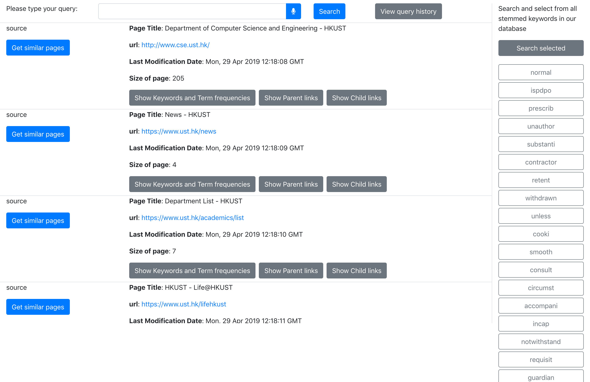

# comp4321-client

* This repository is the client side of search engine course project ([COMP4321](https://course.cse.ust.hk/comp4321/labs/project.html))

* Built on `React.js` with `reactstrap` and `font-awesome`.

* To run the code,
  * Please run its server first. The instruction can be find in [this](https://github.com/webdev-jeff/comp4321-server) repository.
  * Then, `cd` into the directory and run `npm install` followed with `yarn start`. This will start a development version website on `http://localhost:3000` in default setting.
  
* Screenshots

  > **Home Page**

  

  >**Search Page**

  